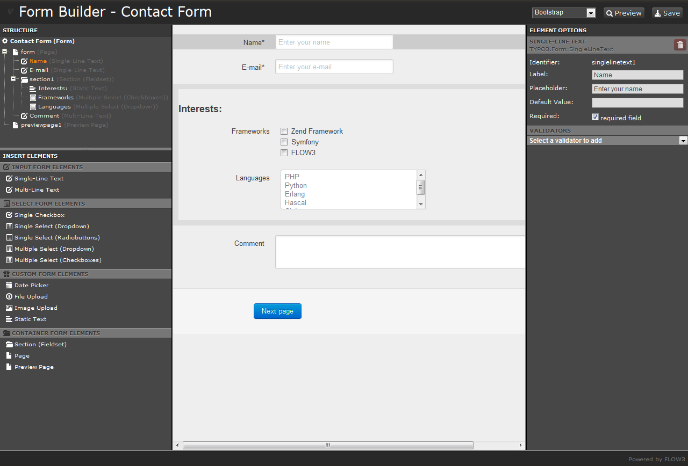
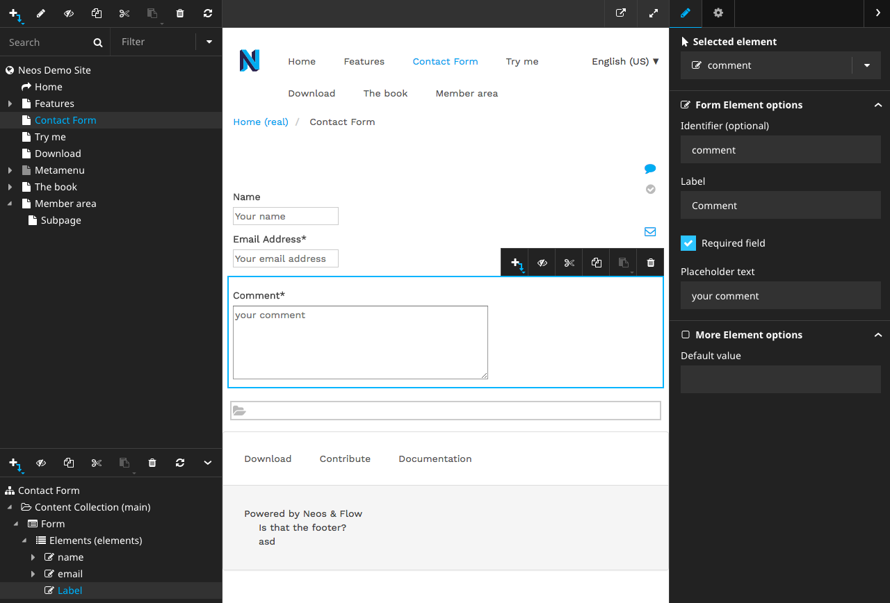

===========================================
Flow Form Framework |version| Documentation
===========================================

This documentation covering version |release| has been rendered at: |today|

Forms
=====

The Form API is an extensible and flexible framework to **build web forms**.

It includes the following features:

* Ready-to-use standard form elements
* Creation of **Multi-Step Forms**
* Server- and Client-Side **Validation**
* highly **flexible rendering** of form elements, based on Fluid or any custom renderer
* **Extensible** with new form elements
* robust, **object oriented API**
* Integration into **Neos Flow** and **Neos CMS**

Also, there are some useful `Related Packages <https://github.com/neos/form#related-packages>`_ that make use
of the extension points and provide useful additions.
For example there is the original `Form YAML Builder <https://packagist.org/packages/neos/form-yamlbuilder>`_ that is a
Flow based web application for graphically assembling and modifying forms:

Since version 5 there's also a `Neos Form Builder <https://packagist.org/packages/neos/form-builder>`_ that adds these
features and more to the Neos CMS Backend:

About This Documentation
========================

This documentation contains a number of tutorial-style guides which will explain
various aspects of the Form API and the Form Framework. It is not intended as in-depth
reference, although there will be links to the in-depth API reference at various points.

.. toctree::
   :maxdepth: 2

   quickstart
   configuring-form-yaml
   adjusting-form-output
   translating-forms
   extending-form-api

Credits
=======

The initial implementation has been generously sponsored by `AKOM360 - Multi Channel Marketing <http://akom360.de>`_.
Further work has been supported by `internezzo ag - agentur für online-kommunikation <http://www.internezzo.ch>`_  and `Format D GmbH <https://www.format-d.com>`_

It has been implemented by:

* Sebastian Kurfürst, `sandstorm|media <https://sandstorm.de>`_
* Bastian Waidelich, `wwwision <http://wwwision.de>`_
